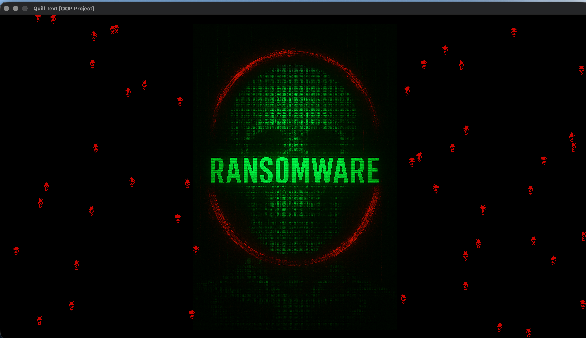
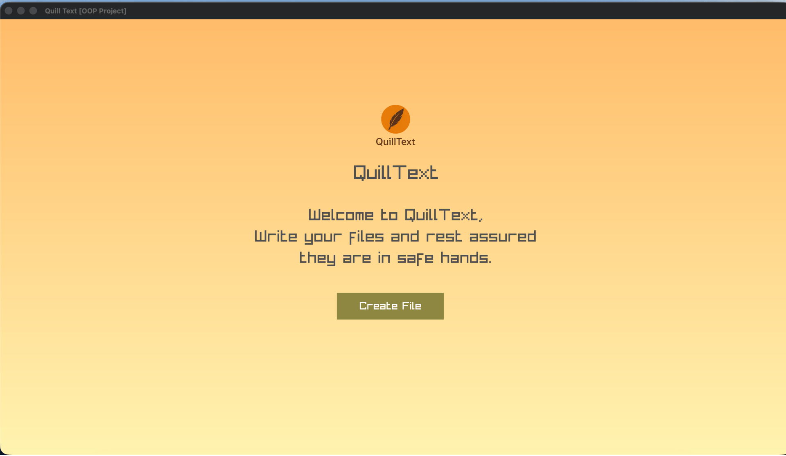
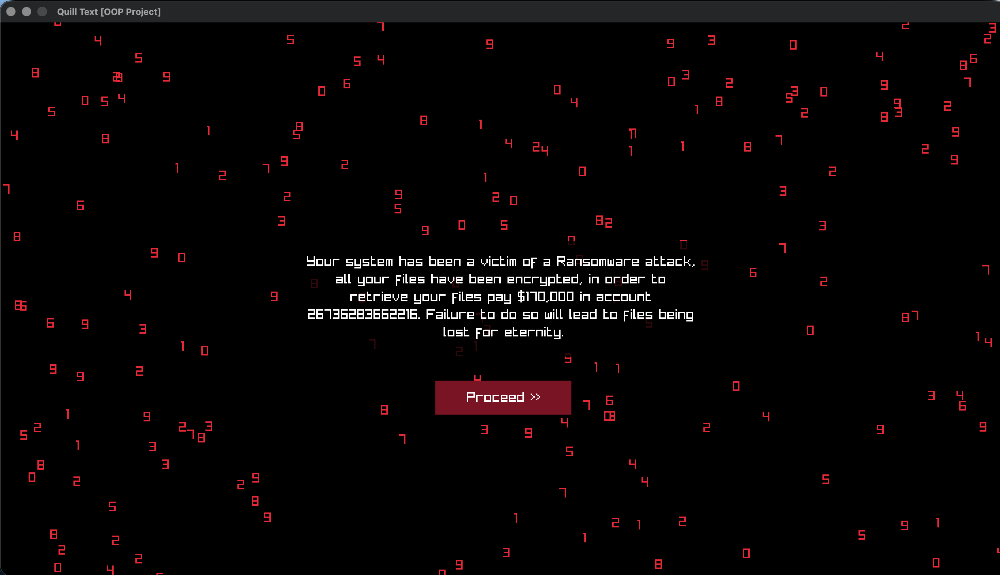
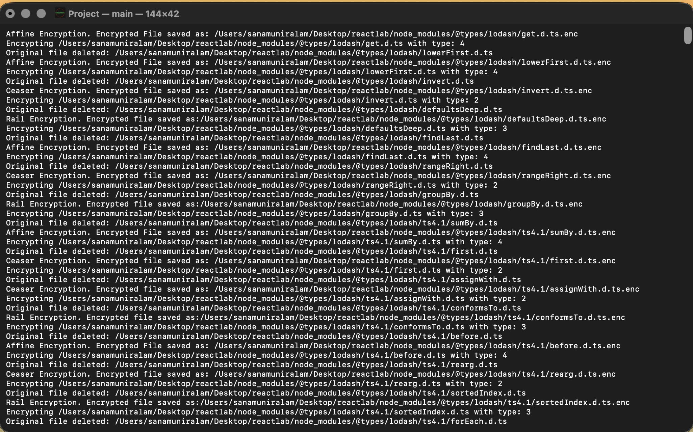
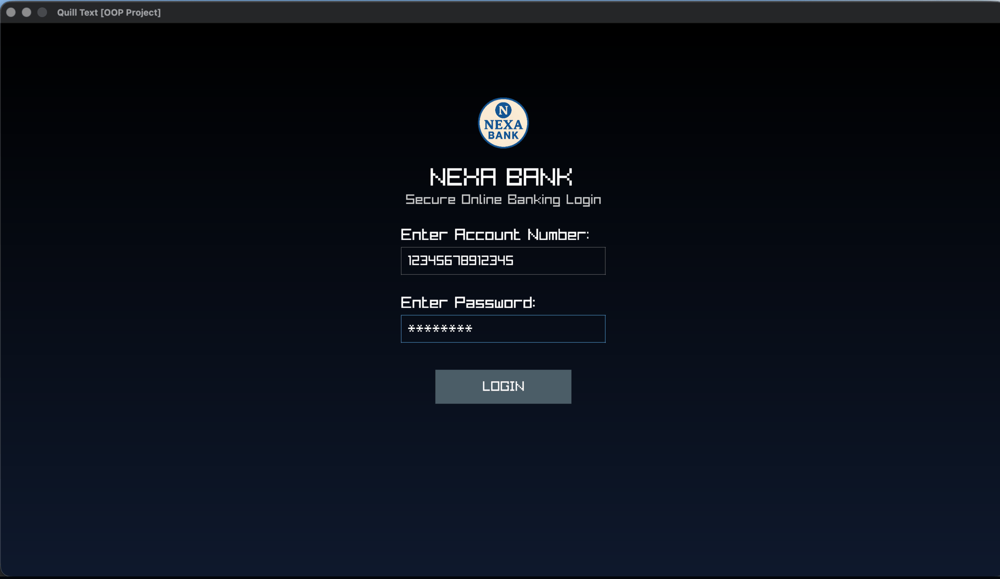
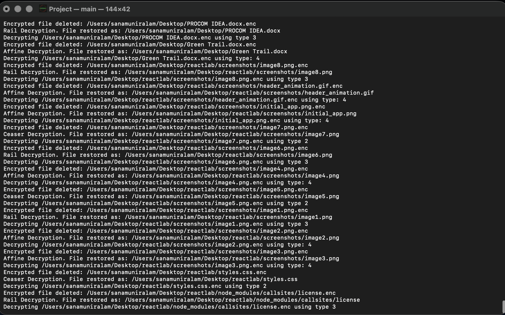
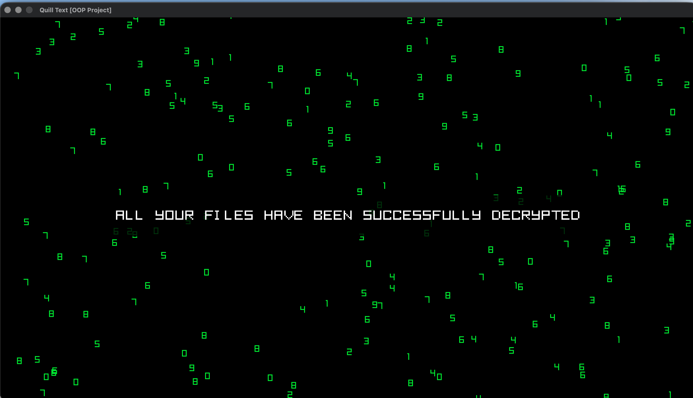

# Ransomware Simulator



## Overview

An object-oriented C++ simulation of a ransomware attack, built as an OOP course project. The application presents itself as a standard graphical text editor (resembling a notepad). When the user saves a file, a staged system "crash" sequence is triggered, after which all files on the user's Desktop are encrypted using four chained classical cipher algorithms. The user is then prompted to make a simulated "ransom payment," receives a generated password, and upon entering the correct password, all files are fully decrypted and restored. The project demonstrates OOP principles including abstraction, polymorphism, encapsulation, and modularity.

> **Disclaimer:** This is a purely educational simulation. No malicious code is present. All encryption targets only files explicitly within the scope of the simulation. Do not run on production systems.

## Features

- **Disguised GUI:** Application launches as a functional notepad-style text editor with a save button, obscuring its actual purpose
- **Staged Crash Animation:** On file save, a fake progress bar halts at 87%, followed by a glitch/matrix visual effect sequence before displaying the ransom message
- **Desktop File Scanner:** Recursively scans the user's Desktop directory and logs all file paths to a text file for encryption targeting
- **Four-Layer Encryption Pipeline:** Files are encrypted sequentially using Vigenère, Caesar, Rail Fence, and Affine ciphers
- **Text and Binary File Support:** Caesar, Rail Fence, and Affine ciphers handle both text (`.txt`) and non-text (binary) files via separate `encryptTXT`/`encryptNON` methods
- **Key Persistence:** Each cipher stores its generated key in a `keylog.txt` file, which is used during decryption to reverse the transformation
- **Ransom Payment Flow:** Simulated transaction, money animation, and thank-you screens before revealing the decryption password
- **Password-Gated Decryption:** A randomly generated 5-character alphanumeric password must be entered correctly to begin decryption
- **Full Decryption Restoration:** All files are fully restored to their original state on correct password entry

## Tech Stack

**Language:** C++17

**Graphics Library:** Raylib

**Encryption Algorithms:**
- Vigenère Cipher (text files)
- Caesar Cipher (text and binary files)
- Rail Fence Cipher (text and binary files)
- Affine Cipher (text and binary files)

**Platform:** macOS (primary; uses `/opt/homebrew` Raylib path)

**Standard Libraries:** `<string>`, `<fstream>`, `<filesystem>` (C++17), `<chrono>`, `<thread>`

## System Design / Working

**OOP Design:**

The encryption subsystem is built around an abstract base class `Encryption` with two pure virtual methods: `encryptTXT()` and `decryptTXT()`. Two additional virtual methods, `encryptNON()` and `decryptNON()`, have default implementations that print an unsupported message, allowing subclasses to opt in for binary file support.

```
Encryption (abstract)
├── VigenereEncryption   → text only
├── CeaserCipher         → text + binary
├── RailFenceEncryption  → text + binary
└── AffineEncryption     → text + binary
```

Each subclass generates its own random key, stores it in `keylog.txt` with a unique entry per file, and retrieves it during decryption. This ensures each file's decryption is reversible.

**Application State Machine:**

The Raylib GUI manages an `AppState` enum with the following flow:

```
MAIN_MENU → CREATE_FILE → LOADING (progress bar halts at 87%)
  → GLITCH_CYCLE → MATRIX_EFFECT → USER_LOGIN
  → TRANSACTION → MONEY_ANIME → THANKS
  → DECRYPT_BEGIN → DECRYPT_ANIME
  → RANSOMWARE (ransom message with typing effect)
```

**File Scanning (`FileScanner.cpp`):**

Uses C++17 `std::filesystem::recursive_directory_iterator` to enumerate all files on the Desktop and write paths to a staging file.

**Encryption Orchestration (`Calling.cpp`):**

Reads the file list and invokes each cipher's encrypt or decrypt method in sequence. For text files, the full pipeline runs (Vigenère → Caesar → Rail Fence → Affine). For non-text files, only the three binary-capable ciphers are applied.

**Password System (`ransomware.cpp`):**

`GenerateRandomPassword()` produces a random 5-character string from lowercase letters and digits. The password is stored in memory and verified via `VerifyPassword()` on user input.

## Screenshots

- "Disguised notepad interface — the application's initial appearance, Staged crash sequence — progress bar halting at 87% before glitch animation"

- "Ransom demand screen with typewriter-effect message"

- "Terminal showing the Files found on User computer, and the encryption applied on them"

- "Simulating Ransom Transaction, and after transfer. Decryption Password is given"

- "Decryption in progress after correct password entry"

- "Decryption Complete, User files are returned to original form"


## How to Run Locally

```bash
# Prerequisites: Raylib installed via Homebrew (macOS)
brew install raylib

# Clone the repository
git clone <repo-url>
cd "Ransomware_Simulator/Final Project"

# Compile
g++ -o main main.cpp FileScanner.cpp Calling.cpp encryption.cpp ransomware.cpp \
    -std=c++17 \
    -I/opt/homebrew/include \
    -L/opt/homebrew/lib \
    -lraylib \
    -framework OpenGL \
    -framework Cocoa \
    -framework IOKit

# Run
./main
```

## Folder Structure

```
Ransomware_Simulator/
├── Final Project/              # Complete integrated application
│   ├── main.cpp                # Raylib GUI and app state machine
│   ├── FileScanner.cpp / .h    # Desktop file enumeration
│   ├── Calling.cpp / .h        # Encryption/decryption orchestration
│   ├── encryption.cpp / .h     # Abstract base class + 4 cipher implementations
│   └── ransomware.cpp / .h     # Password generation and verification
│
└── OOP_Applied/                # Modular prototype / earlier iteration
    ├── ceaser.cpp / .h
    ├── railfence.cpp / .h
    ├── encryption.cpp / .h     # Base class
    ├── log.cpp / .h            # Key logging
    └── wrap.cpp                # Orchestration wrapper
```

## My Role

I led the design and development of the overall system, implementing the core architecture and the majority of the application logic.

- Designed the complete object-oriented architecture, including the abstract `Encryption` base class and polymorphic cipher implementations  
- Implemented the full encryption pipeline, including the Vigenère cipher and the orchestration logic chaining all four algorithms  
- Developed the file scanning system using C++17 `std::filesystem` and handled end-to-end encryption/decryption flow  
- Built the Raylib-based GUI and application state machine, including the notepad disguise, staged crash sequence, glitch/matrix effects, and ransom interaction flow  
- Implemented key generation, logging, and retrieval mechanisms to ensure accurate per-file decryption  
- Designed and implemented the password-based decryption system  

Additional contributions:
- Caesar Cipher implemented by Adeena  
- Rail Fence and Affine Cipher implementations contributed by Ahmed Affan  
